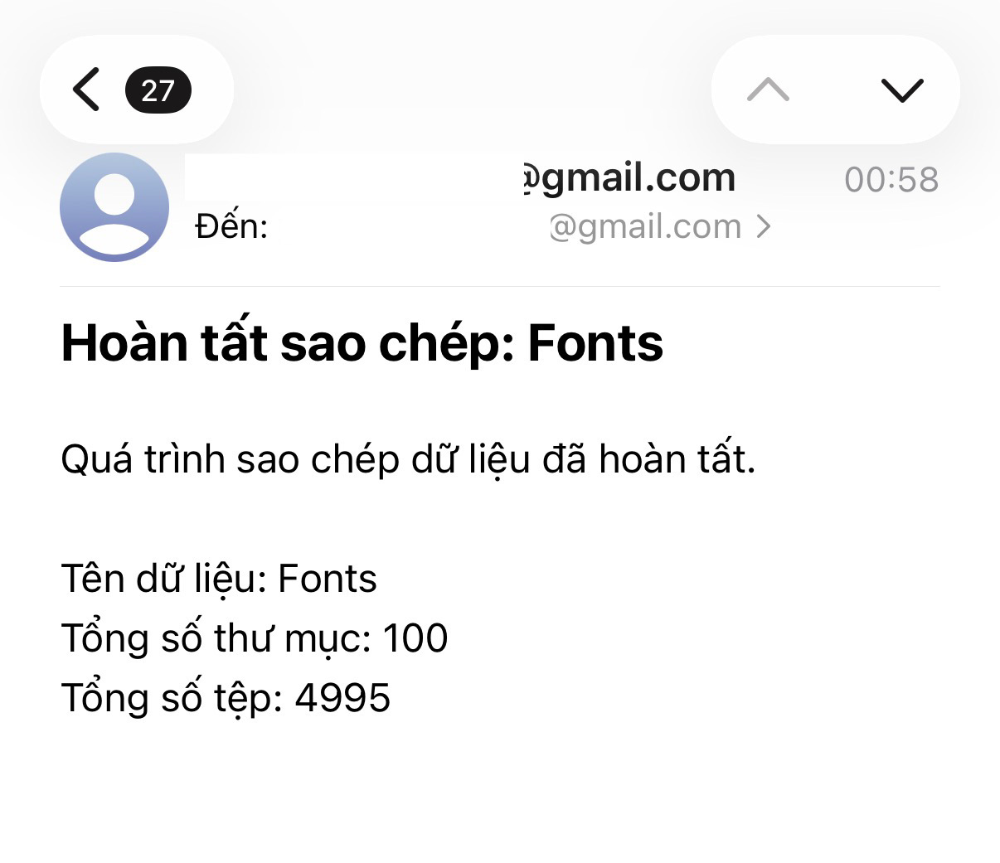

# Google Drive Copy Assistant (iOS Shortcut)

Công cụ hỗ trợ sao chép tệp tin và thư mục khổng lồ trên Google Drive chỉ bằng một cú chạm từ iPhone/iPad. Giải quyết triệt để vấn đề "hết thời gian chờ" (timeout) và hỗ trợ thống kê dữ liệu sau khi hoàn tất.

## Tính năng nổi bật
- Không treo máy: Xử lý lệnh trong 1 giây trên iPhone, quá trình copy thực sự diễn ra ngầm trên máy chủ Google.
- Hỗ trợ dữ liệu lớn: Cơ chế "chạy tiếp sức" tự động chia nhỏ đợt copy để vượt qua giới hạn 6 phút của Google.
- Thống kê chi tiết: Tự động đếm chính xác số lượng tệp và thư mục đã sao chép.
- Thông báo thông minh: Gửi email báo cáo kèm kết quả thống kê ngay khi hoàn tất.
- Linh hoạt: Tự động bóc tách ID từ Link công khai, không cần cấu hình phức tạp.

## Hướng dẫn cài đặt

### Bước 1: Tạo "Bộ não" bằng Google Apps Script
1. Truy cập: https://script.google.com  
2. Đăng nhập bằng tài khoản Google Drive mà bạn muốn nhận file về.  
3. Nhấn **Dự án mới (New Project)**.  
4. Đặt tên cho dự án (ví dụ: `CopyDrive_Shortcut`).  
5. Xóa hết đoạn code cũ và dán toàn bộ nội dung file `code.gs` vào.  

### Bước 2: Triển khai (Deploy) để lấy Link API
1. Nhấn **Deploy → New deployment**.  
2. Chọn loại là **Web app**.  
3. Cấu hình:
   - Execute as: Me (Tài khoản của bạn)
   - Who has access: Anyone (Bất kỳ ai)
4. Nhấn **Deploy** và **Authorize access** để cấp quyền (chọn *Advanced → Go to...* nếu thấy cảnh báo).  
5. Lưu lại dòng **Web app URL** để sử dụng ở Bước 3.  

### Bước 3: Cài đặt Phím tắt trên iOS
1. Tải Phím tắt bằng đường link sau: [https://www.icloud.com/shortcuts/ff41d06a9cc846a188ca2d3b6b0b28b5](https://www.icloud.com/shortcuts/ff41d06a9cc846a188ca2d3b6b0b28b5) 
 - Hoặc tải file `Copy GDrive.shortcut` trong mã nguồn này.
2.Khi nhấn thêm phím tắt sẽ hiện ra bản dữ liệu đầu vào dán dòng **Web app URL** đã copy ở Bước 2 vào.
3. Nhấn **Xong** để lưu lại.  

## Hướng dẫn sử dụng
1. Mở Phím tắt hoặc chạy từ Widget/Menu chia sẻ.  
2. Nhập Link cần copy: Dán link file hoặc thư mục Google Drive (đã bật chia sẻ công khai).  
3. Nhập Link thư mục đích: Dán link folder bạn muốn lưu vào (bỏ trống để lưu ngay tại thư mục gốc Drive của bạn).  
4. Theo dõi:
   - iPhone sẽ báo "Yêu cầu đã được tiếp nhận" ngay lập tức.  
   - Hệ thống bắt đầu quét và copy ngầm.  
   - Bạn có thể ném liên tục vài link cần coppy sẽ có hệ thống trigger chia thời gian làm việc
   - Khi hoàn tất, bạn sẽ nhận được một Email từ chính bạn với nội dung thống kê chi tiết (số file, số folder).  
   

## Lưu ý quan trọng
- Cấp quyền lần đầu: Trong lần triển khai đầu tiên, bạn nên cấp cho nó 3 full quyền(trigger, gửi mail cho chính mình, chạy script copy file drive) . Nếu không, phím tắt sẽ báo lỗi quyền `ScriptApp`.  
- Giới hạn của App Script: 90 phút mỗi ngày cho tài khoản free
- Giới hạn của Google: Mặc dù đã có cơ chế chạy tiếp sức, nhưng nếu thư mục quá lớn (vài chục ngàn file), thời gian hoàn thành có thể kéo dài vài chục phút tùy dung lượng.  
- Đối với limit của goolge drive là <750gb/ngày

## Mã nguồn
- `code.gs`: Chứa logic xử lý đệ quy và chạy tiếp sức trên Google Apps Script.  
- `Copy GDrive.shortcut`: Giao diện người dùng trên iOS.  